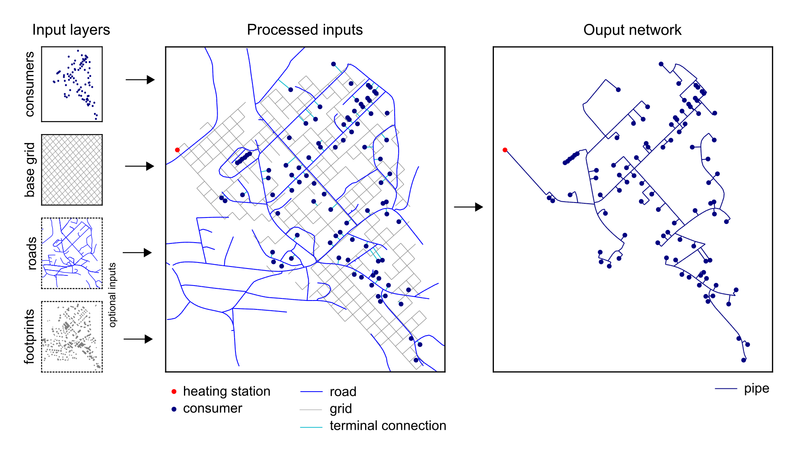

# DHgeN

**DHgeN** is a Python module for generating District Heating Networks layouts.



It has been conceived to work with the following open datasets available in Switzerland through the [GeoAdmin's REST services](https://api3.geo.admin.ch/services/sdiservices.html):

- the Swiss Federal Register of Buildings and Dwellings (RegBL) `ch.bfs.gebaeude_wohnungs_register` 
- vector building footprints `ch.swisstopo.vec25-gebaeude`
- vector road network `ch.swisstopo.swisstlm3d-strassen`

Alternatively, an input GeoPackage file can be used. This should be composed of the following layers:

- `substations` (point geometry) with a `peak` attribute indicating the peak power of the substations in kW
- `roads` (line geometry), mandatory only if the `add_roads` options is set to `True`
- `footprints` (polygon geometry), mandatory only if the `add_footprints` options is set to `True`

An (approximation of the) Steiner tree can be created using:

- NetworkX integrated algorithm
- the [Hušek et al. model](https://github.com/goderik01/PACE2018)

Additional information can be found in the conference paper presented at the [EUROSUN 2022 Conference](#citation). 

## Installation

You can use `pip` to install this package, e.g. with:

```pip install git+https://github.com/idiap/dhgen.git```

For further development, download the repository, then install it in editable mode:

```pip install -e /path/to/dhgen```


## Use

Sample working examples can be found in `/examples`.
When using the `husek` model, the `star_contractions_test` compiled executable must be in the Path.

The Dockerfile provides a pipeline that compiles the model and installs all requirements:
```
docker build . -t dhgen
docker run dhgen python examples/generate_dhn.py
```


## <a name="citation"></a>Citation

DHgeN is free to use. You are kindly invited to acknowledge its use by citing it in a research paper you are writing, reports, and/or other applicable materials.
When available (pending review, expected publication in January 2023), please cite the following paper:

    @inproceedings{peronato_dhgen_2022,
    location = {Kassel, Germany},
    title = {{DHgeN}: Automated Generation of District Heating Network Layouts for Feasibility Studies},
    eventtitle = {{EuroSun2022}},
    booktitle = {Pending review},
    author = {Peronato, Giuseppe and Kämpf, Jérôme Henri},
    date = {2022}
    }

The pre-print (authors' version before review) can be found in [Idiap's publication repository](http://publications.idiap.ch/index.php/publications/show/4871).

## License

DHgeN: a Python module for generating District Heating Networks layouts.

Copyright (c) 2022 Idiap Research Institute, http://www.idiap.ch  
Written by Giuseppe Peronato <Giuseppe.Peronato@idiap.ch>

This file is part of DHgeN.

DHgeN is free software: you can redistribute it and/or modify
it under the terms of the GNU General Public License version 3 as
published by the Free Software Foundation.

DHgeN is distributed in the hope that it will be useful,
but WITHOUT ANY WARRANTY; without even the implied warranty of
MERCHANTABILITY or FITNESS FOR A PARTICULAR PURPOSE. See the
GNU General Public License for more details.

You should have received a copy of the GNU General Public License
along with DHgeN. If not, see <http://www.gnu.org/licenses/>


## Useful links

- [GeoAdmin API](https://api3.geo.admin.ch/)
- [Hušek et al.'s SteinerTreeHeuristics](https://github.com/goderik01/PACE2018)


## Contributors(a-z):

- [Giuseppe Peronato](https://www.giuseppeperonato.com)


## Acknowledgments

This module has been developed in the framework of the [Eguzki research project](https://www.aramis.admin.ch/Kategorien/?ProjectID=47432&Sprache=en-US), funded by the Swiss Federal Office of Energy, OIKEN SA, ALTIS Groupe SA, SATOM SA and RWB Valais SA.


